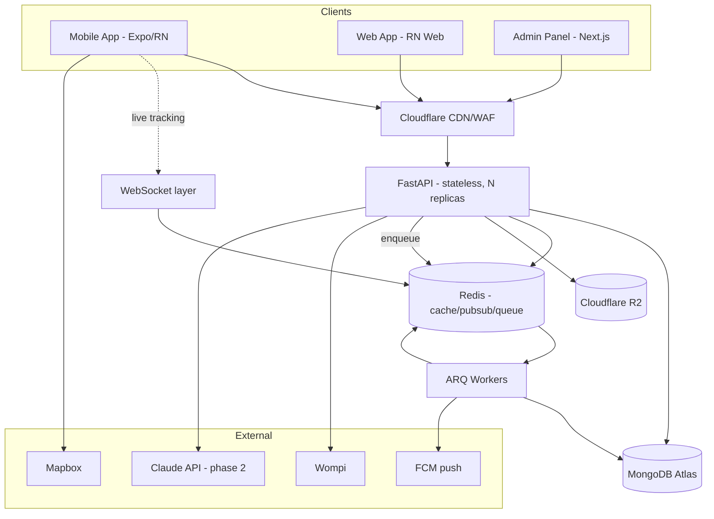

# BarriApp — Architecture Document

> Status: **Design phase**. This document is the single source of truth for the
> technical architecture of BarriApp. Language: English (team reference).

## 1. Product overview

BarriApp is a mobile-first delivery platform for **small neighborhood stores
("tiendas de barrio")** in Colombia, plus a **peer-to-peer errand network**
("mandados") where collaborators earn money running short favors for people
nearby. It targets a niche that large players (Rappi, Didi) underserve.

### User roles
- **Super Admin** — full platform control, moderation, configuration, metrics.
- **Seller (tendero)** — owns a store, manages catalog/inventory/orders.
- **Collaborator (repartidor/mandadero)** — fulfills deliveries and free errands.
- **Client** — buys from stores and/or posts errands.

A single **identity** (`users`) may hold multiple **roles** simultaneously.

## 2. Architecture principles
- **Mobile-first, API-driven.** One backend serves native mobile + web clients.
- **Stateless backend.** Horizontal scaling; shared state in Redis/MongoDB.
- **Modular by domain.** Clear module boundaries to stay maintainable as it grows.
- **Async everywhere.** FastAPI + Motor for high concurrency on mobile traffic.
- **Design for AI from day one.** Data shaped so the RAG assistant can plug in later.
- **Balanced MVP.** Ship fast, but on foundations that won't need a rewrite.

## 3. Technology stack

### Backend
| Concern | Choice |
|---------|--------|
| Language | Python 3.12 |
| Framework | FastAPI (async) |
| ODM | Beanie (on Motor) + Pydantic v2 |
| Database | MongoDB Atlas |
| Cache / Pub-Sub / Queue broker | Redis |
| Background jobs | ARQ (async-first) or Celery |
| Realtime | WebSockets (FastAPI) + Redis Pub/Sub |
| Auth | JWT (access + refresh), RBAC |
| Geo | MongoDB 2dsphere indexes |
| Object storage | Cloudflare R2 (S3-compatible, no egress fees) |

### Clients
| Target | Choice |
|--------|--------|
| Mobile (Android + iOS) + Web | **React Native + Expo** (+ `react-native-web`) — chosen to reuse the team's JS/React skills across all three platforms from one codebase |
| Super Admin panel | Next.js + React (dedicated web app, heavy dashboards) |

### Third-party services (Colombia)
| Concern | Choice |
|---------|--------|
| Payments | **Wompi** (PSE, cards, Nequi, Bancolombia) + **cash on delivery** |
| Maps / routing | Mapbox (or Google Maps Platform) |
| Push notifications | Firebase Cloud Messaging (FCM) |
| SMS / OTP | Twilio or a local Colombian SMS provider |
| Error tracking | Sentry (from MVP) |

### AI assistant (phase 2)
| Concern | Choice |
|---------|--------|
| Reasoning engine | Claude API (Anthropic) |
| Retrieval | MongoDB **Atlas Vector Search** (`ai_knowledge.embedding`) |
| Grounding | Tool/function calling into BarriApp's own API |

> The assistant is "ours" in that the data, prompts, knowledge base, and tools
> are proprietary; the base LLM is a managed provider. Training a model from
> scratch is not justified at this stage.

## 4. System architecture



### Backend module layout
```
app/
  core/          # config, security, db, deps, middleware
  auth/          # register, login, OTP, JWT, RBAC
  users/         # identity + profiles (addresses, device tokens)
  stores/        # store profiles, schedules, delivery config
  catalog/       # categories, products
  orders/        # order lifecycle + state machine
  errands/       # free errands ("mandados")
  delivery/      # assignment, tracking, proof, WebSockets
  payments/      # Wompi integration, cash, webhooks, ledger
  notifications/ # FCM, in-app
  reviews/       # ratings
  audit/         # cross-cutting audit trail service (write-once)
  ai/            # RAG assistant (phase 2)
  admin/         # metrics, audit log access, platform config
```
Each module: `router.py`, `models.py` (Beanie), `schemas.py` (Pydantic I/O),
`service.py` (business logic), `repository.py` (data access). API versioned `/api/v1`.

## 5. Realtime & geolocation
- Live delivery tracking via WebSocket; collaborator location updates are
  throttled client-side and fanned out via Redis Pub/Sub (works across replicas).
- Proximity queries ("stores near me", "available collaborators near an order",
  "open errands near me") use 2dsphere indexes with `$near`/`$geoWithin`.
- Collaborator matching: geo query for `online` collaborators within radius,
  ranked by distance/rating; assignment via background job.

## 6. Security
- TLS everywhere; encryption at rest (Atlas).
- JWT access (short-lived) + refresh (rotating). RBAC dependency per endpoint,
  enforcing role **and** resource ownership.
- Rate limiting on auth and AI endpoints.
- Wompi webhook signature (HMAC) verification; payment endpoints idempotent.
- PII minimization; no PII in logs; audit log for sensitive/admin actions.
- Secrets via environment/secret manager, never committed.

### Audit trail (cross-cutting)
Every meaningful action across **all modules** (user lifecycle, login/logout,
store/catalog/order/errand/delivery/payment changes, admin config) is written to
an **append-only `audit_logs`** store, **readable only by `super_admin`**.
A central `audit/` service records `{ module, action, actor, target, changes,
result, metadata }`; writes go through the async queue (with a synchronous
fallback for critical security events) so they never block the request. This is
distinct from operational logging (§9). Full design in
[AUDIT_LOG.md](AUDIT_LOG.md).

## 7. Data & privacy (Colombia)
- **Ley 1581/2012 (Habeas Data):** explicit consent captured at registration
  (`users.consent`), privacy policy, and **database registration with the SIC (RNBD)**.
- **DIAN electronic invoicing** for platform commissions.
- **Collaborator classification risk:** contractor-vs-employee model must be
  addressed in Terms with local legal counsel — highest legal risk of the model.
- Payment regulation offloaded to Wompi (avoids handling third-party funds directly).
- Data retention & deletion policy; right to access/rectify.

## 8. Deployment & infrastructure

### MVP (low cost, fast)
- Backend containerized (Docker), deployed on **Railway / Render / Fly.io**.
- MongoDB Atlas (M10), managed Redis (Upstash), Cloudflare R2.
- CI/CD via **GitHub Actions** (lint → test → build → deploy).
- Web + Admin on Vercel/Cloudflare Pages; mobile via Play Store + App Store (EAS).

### Scale phase
- Migrate backend to **Google Cloud Run** or **AWS ECS Fargate** (serverless
  containers, autoscaling) — Kubernetes only if the team justifies it.
- Cloudflare CDN + WAF, centralized logs, Prometheus/Grafana or Datadog.
- **Terraform** for infrastructure-as-code from the start.
- MongoDB sharding when data/traffic requires it.

### Environments
`local` (docker-compose) → `staging` → `production`, with separate Atlas clusters
and secrets per environment.

## 9. Observability
- Sentry for errors (backend + clients) from MVP.
- Structured JSON logging with request/correlation IDs.
- Health/readiness endpoints; uptime monitoring.
- Business metrics (GMV, orders, active users) exposed to the admin panel.

## 10. Testing & quality
- `pytest` (unit + integration against ephemeral Mongo).
- `ruff` (lint/format), `mypy` (typing), `pre-commit` hooks.
- Contract tests against the OpenAPI schema.
- CI gates: tests + lint must pass before deploy.

## 11. Roadmap (phases)
1. **Phase 0 – Design:** data model, API contracts, wireframes, commission rules.
2. **Phase 1 – MVP core:** auth+roles, store catalog, order lifecycle, collaborator
   assignment, basic tracking, payments (cash + Wompi), push, minimal admin.
3. **Phase 2 – Differentiators:** free errands, AI assistant (RAG), dashboards,
   route optimization.
4. **Phase 3 – Scale:** infra migration, full observability, security hardening.

## 12. Key risks
| Risk | Mitigation |
|------|-----------|
| Collaborator legal classification | Legal counsel; clear contractor Terms |
| Low trust in cash/online payments in barrios | Cash on delivery + Wompi + ratings |
| Two-sided marketplace cold start | Launch neighborhood by neighborhood |
| Geo/matching complexity | Lean on Mongo 2dsphere; iterate matching later |
| AI hallucination in support | RAG grounding + tool calling to real data |
