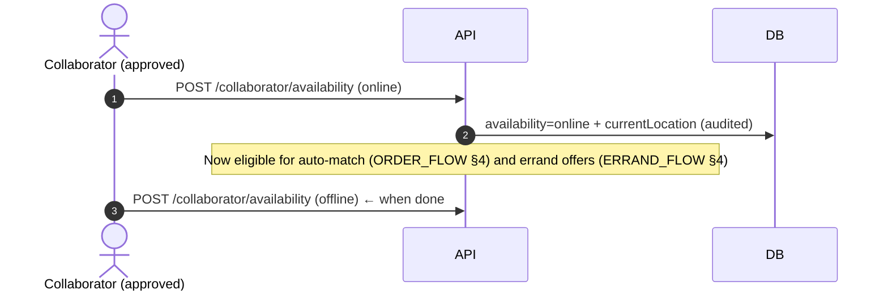

# BarriApp — Collaborator Onboarding & Verification

> Status: **Design**. Complements [DATA_MODEL.md](DATA_MODEL.md)
> (`collaborator_profiles`), [API_CONTRACT.md](API_CONTRACT.md) (§2, §9),
> [AUDIT_LOG.md](AUDIT_LOG.md), and the legal notes in
> [ARCHITECTURE.md](ARCHITECTURE.md) §7. Defines how a person becomes a verified
> collaborator (courier / errand-runner) who can accept deliveries and errands.

## 1. Goals
- Onboard collaborators with **low friction** but enough **KYC & trust** to keep
  clients and stores safe (they handle other people's money and goods).
- Keep the **contractor** relationship clear and legally sound (top legal risk —
  see ARCHITECTURE §7); explicit collaborator Terms acceptance is mandatory.
- Every verification decision is **audited** (`collaborator.verification.changed`).

## 2. Verification state machine

```
(user with client role)
        │ apply
        ▼
   draft ──submit──▶ pending ──pick up──▶ under_review
                                   │
             ┌─────────────────────┼─────────────────────┐
             ▼                     ▼                     ▼
        approved             needs_more_info          rejected
             │                     │ (resubmit)          │ (final / appeal)
             ▼                     └───────▶ pending      │
     active (can go online) ◀───────────────────────────┘ (on successful appeal)
             │
   suspended ⇄ active   (policy/rating/document expiry)
             │
        offboarded (voluntary or permanent ban)
```

Mapped to `collaborator_profiles.verificationStatus`:
`pending | under_review | needs_more_info | approved | rejected` — plus the
user/account-level `active | suspended` for operational status.

## 3. Required data & documents (Colombia)
| Item | Purpose | Notes |
|------|---------|-------|
| Full name, phone (verified), email | Identity/contact | Phone already verified at signup |
| Cédula (ID number) + photo front/back | KYC identity | Redacted/encrypted; PII |
| Selfie / liveness | Match ID to person | Basic anti-fraud |
| Vehicle type | Matching & fees | `walk`/`bike`/`motorcycle`/`car` |
| Driver's license | If `motorcycle`/`car` | Conditional |
| SOAT + tecnomecánica | If motorized vehicle | Legal to circulate |
| Payout account (Nequi/bank) | Earnings payout | For ledger settlement |
| Collaborator Terms acceptance | Legal (contractor model) | Versioned & audited |
| Habeas Data consent | Data law (Ley 1581) | Already captured at signup; re-confirm scope |

> **Decided (MVP):**
> - Verification is **manual**, performed by the `super_admin` (no automated KYC
>   provider at launch; a hybrid/automated flow may come later).
> - **No background/police-record check at launch** (avoids friction + sensitive
>   data handling); may be added later.

## 4. Onboarding flow

```mermaid
sequenceDiagram
    autonumber
    actor U as User (client)
    participant App
    participant API
    participant DB as MongoDB
    participant OBJ as R2 (docs)
    actor SA as Super Admin
    participant Q as Queue
    participant FCM

    U->>App: Tap "Become a collaborator"
    App->>API: POST /me/become-collaborator
    API->>DB: create collaborator_profile (verificationStatus=pending, draft)
    API->>DB: audit(user.role.requested / collaborator.created)
    API-->>App: profile draft

    App->>U: Show required steps (docs, vehicle, payout, Terms)
    U->>App: Upload ID/selfie/license, vehicle info, payout account
    App->>OBJ: upload document images (private, signed URLs)
    App->>API: PATCH collaborator profile (doc refs, vehicle, payout)
    U->>API: Accept Collaborator Terms + Habeas Data (versioned)
    API->>DB: store consent + docs; verificationStatus=pending
    API->>Q: notify admin "new collaborator to review"

    SA->>API: GET pending collaborators (admin)
    API->>DB: verificationStatus=under_review + audit
    SA->>API: PATCH /collaborator/verification (approve | reject | needs_more_info + reason)
    alt approved
        API->>DB: verificationStatus=approved; grant collaborator role active
        API->>DB: audit(collaborator.verification.changed = approved)
        API->>Q: notify(user, "you're approved!")
        Q->>FCM: push
    else needs_more_info
        API->>DB: verificationStatus=needs_more_info(+reason)
        API->>Q: notify(user, "please resubmit X") --> back to upload
    else rejected
        API->>DB: verificationStatus=rejected(+reason)
        API->>Q: notify(user, "rejected — appeal option")
    end
```

## 5. Post-approval: going active



- Only `approved` + `active` collaborators can go `online`.
- Location updates while online feed the 2dsphere matching (throttled, audited at
  a coarse level to avoid log noise — see AUDIT_LOG redaction/volume notes).

## 6. Ongoing lifecycle: suspension, re-verification, offboarding
| Event | Trigger | Handling |
|-------|---------|----------|
| Document expiry | SOAT/license expires | Auto-flag → `needs_more_info`, block going online until renewed |
| Low rating / complaints | Rating below threshold, disputes | Warning → temporary `suspended` → review |
| Policy violation | Fraud, safety, prohibited items | `suspended` or permanent `offboarded` (audited) |
| Voluntary exit | Collaborator requests | `offboarded`; retain records per retention policy |
| Reinstatement | Appeal / fixed issue | Back to `under_review` → `approved` |

## 7. Trust & safety controls
- Verified identity + payout account before first job.
- Two-way ratings (client↔collaborator); thresholds gate continued activity.
- Live tracking shared with the client during active jobs.
- In-app contact masking (no raw phone numbers exchanged).
- All verification and status changes **audited** and visible to `super_admin`.

## 8. Legal alignment (critical)
- **Collaborator Terms** codify the **independent-contractor** relationship
  (not employment) — reviewed by local counsel (top legal risk, ARCHITECTURE §7).
- Terms and consent are **versioned**; the accepted version + timestamp are stored
  and audited, so it's provable which version each collaborator accepted.
- Document images are **PII**: encrypted at rest, private storage, access limited
  and audited; retention/deletion policy applies.

## 9. Endpoints touched
- `POST /me/become-collaborator` (create draft profile) — [API_CONTRACT.md](API_CONTRACT.md) §2
- Profile/document updates (PATCH profile + signed upload URLs) — to be detailed
  when this enters implementation
- `POST /collaborator/availability`, `GET /collaborator/jobs`,
  `GET /collaborator/earnings` — §9
- `PATCH /collaborator/verification` (super_admin approve/reject/needs_more_info) — §9

## 10. Backlog linkage
Maps to MVP_BACKLOG U-5 (apply as collaborator), D-2 (availability/jobs), D-6
(super_admin verifies documents), and legal L-3 (collaborator Terms). Document
upload/KYC detail and the appeal flow may extend these stories when scheduled.
```
