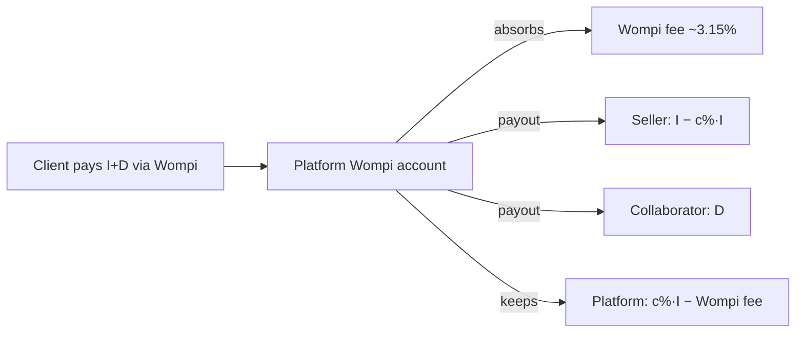
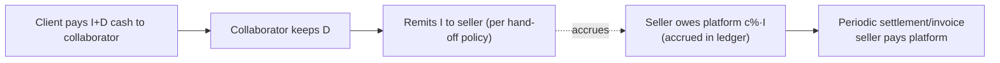

# BarriApp — Commission & Subscription Model

> Status: **Design** (decisions made 2026-06-30). Defines how the platform earns
> revenue, how money flows (cash vs. Wompi), how commissions are settled, and the
> seller subscription (freemium) — designed now, **activated post-MVP**.
> Complements [DATA_MODEL.md](DATA_MODEL.md) (`stores.commissionRate`,
> `ledger_entries`), [ORDER_FLOW.md](ORDER_FLOW.md), [SELLER_FLOW.md](SELLER_FLOW.md),
> and [AUDIT_LOG.md](AUDIT_LOG.md).

## 1. Decisions (locked)
- **Single revenue stream at launch: a percentage commission charged to the
  seller** on the order's items total.
- **Structure: percentage** (not flat, not hybrid), configurable per store via
  `stores.commissionRate` (overrides a global default).
- **Delivery fee → 100% to the collaborator.** The platform takes no cut of
  `deliveryFee` at launch.
- **No client-facing service fee** at launch.
- **Wompi processing fee (~2.65% + IVA) is absorbed by the platform** (comes out
  of commission margin) — no surcharge to seller or client.
- **Cash commission is collected via periodic settlement/invoicing to the seller.**
- **Errand commission: deferred.** Errands have no store, so seller commission
  doesn't apply. A small platform take on `offeredFee` is the likely future model;
  for the (cash-only, phase-2) launch of errands, treat platform take as **0% /
  to-be-decided** — flagged below.
- **Seller subscription (freemium): designed now, activated post-MVP.** Premium's
  headline benefit is a **reduced commission rate** + visibility + marketing tools.

> **Still to decide (business values, not architecture):** the actual commission
> **percentage** (e.g. a launch range of ~8–15%), the **settlement frequency**
> (recommend biweekly free / weekly premium), the **subscription price**, and the
> **cash hand-off choreography** in §4.2.

## 2. Money components per order
| Component | Symbol | Who ultimately keeps it |
|-----------|--------|-------------------------|
| Items total | `I` | Seller, minus commission |
| Delivery fee | `D` | Collaborator (100%) |
| Platform commission | `c% × I` | Platform (revenue) |
| Wompi fee (online only) | `~3.15% × (I+D)` | Cost absorbed by platform |

Seller net = `I − c%·I`. Collaborator net = `D`. Platform net (online) =
`c%·I − Wompi fee`. Platform net (cash) = `c%·I` (collected via settlement).

## 3. Effective commission rate resolution
```
effectiveRate = store.commissionRate (if set)
             else subscription.commissionRate (if Premium & set)
             else platformConfig.defaultCommissionRate
```
Premium subscription lowers the effective rate (the subscription's main value).
The resolution + inputs are recorded on each order's `amounts` snapshot so
historical orders keep the rate applied at the time (auditable).

## 4. Money flow

### 4.1 Wompi (online, prepaid) — platform handles the money

Ledger on delivery+approval: `earning`(seller, `I−c%·I`), `earning`(collaborator,
`D`), `commission`(platform, `c%·I`), and a cost record for the absorbed Wompi fee.
Seller/collaborator balances are paid out on the payout schedule.

### 4.2 Cash (on delivery) — platform never touches the money

Because cash never flows through the platform, the commission `c%·I` is **accrued
as a receivable from the seller** and collected via a **periodic settlement**
(recommend biweekly). Ledger on delivery: `earning`(collaborator `D`),
`commission`(platform `c%·I`, marked *unsettled*); settlement marks it *settled*.

> **Cash hand-off policy (to confirm):** default proposal — the collaborator
> collects `I+D` from the client, keeps `D`, and remits `I` to the seller; the
> seller then settles `c%·I` with the platform periodically. Alternatives (e.g.
> collaborator pays the seller `I` at pickup) shift who fronts cash — an
> operational choice to validate with real tenderos/collaborators.

## 5. Settlement & payouts
- **Sellers (cash orders):** platform generates a **settlement statement** per
  period (orders, gross items, commission owed) → seller pays via their registered
  account/Wompi. Overdue → optional auto-suspend of the store (config).
- **Sellers (online orders):** platform already holds the money → pays out
  `I − c%·I` on schedule.
- **Collaborators:** `D` accrues to their balance; paid out on schedule (online)
  or already in hand (cash). See `collaborator_profiles.balance` + `ledger_entries`.
- All settlement/payout events are **audited** (`ledger.entry.created`,
  `payment.approved`, plus admin actions).

## 6. Seller subscription (freemium) — post-MVP

| | Free (Básico) | Premium (monthly) |
|--|---------------|-------------------|
| Commission rate | Standard | **Reduced** (main hook) |
| Search visibility | Normal | **Featured / priority** in the neighborhood |
| Marketing | — | Promotions, coupons, push to nearby clients |
| Analytics | Basic | Advanced (top products, peak hours, repeat rate) |
| Catalog | Capped (products/photos) | Expanded / unlimited |
| Settlement | Biweekly | **Weekly** |
| Support | Standard | Priority |
| Extras | — | Verified badge, staff accounts |

- **Billing:** monthly, charged via **Wompi recurring/card**; `status` handles
  `active | past_due | cancelled`; grace period before dropping to Free.
- **Incentive alignment:** high-volume sellers subscribe because the reduced
  commission outweighs the fee → self-funding.
- **Future tiers (not now):** client "Prime" (reduced delivery fees), collaborator
  perks.

## 7. Data model additions (to fold into DATA_MODEL.md when implemented)
- **`subscriptions`**: `{ _id, storeId, plan(free|premium), status(active|past_due|
  cancelled), commissionRate?, price, startedAt, renewsAt, paymentRef, createdAt }`.
- **`settlements`** (seller commission statements): `{ _id, storeId, periodStart,
  periodEnd, ordersCount, grossItems, commissionTotal, status(pending|paid|overdue),
  dueDate, paidAt, paymentRef }`.
- **`ledger_entries`**: extend `type` with `subscription_fee` and `settlement`;
  add a `settled: bool` flag for cash commissions.
- **`orders.amounts`**: persist the resolved `commissionRate` + `platformFee`
  snapshot per order (auditable, immutable).
- **`stores.commissionRate`** already exists (per-store override).
- **`admin config`**: `defaultCommissionRate`, `settlementFrequency`,
  `subscriptionPrice`, `premiumCommissionRate`.

## 8. Reporting & audit
- Platform revenue (commissions + future subscriptions) surfaces in the
  `super_admin` dashboard ([ADMIN_PANEL.md](ADMIN_PANEL.md) §2.1).
- Every commission accrual, settlement, payout, and subscription charge is an
  auditable `ledger`/`payments` event.

## 9. Backlog linkage
Extends P-4 (ledger) and P-5 (balances). New MVP stories implied: commission
calculation in order creation (part of O-1), and a **seller settlement** feature
(cash commission invoicing). Subscription is a **post-MVP epic** (design ready).
```
