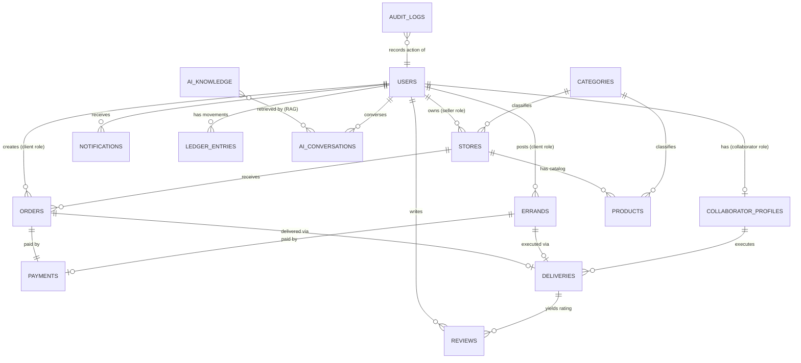

# BarriApp — Data Model (MongoDB)

> Status: **Design**. Database: MongoDB Atlas. ODM: Beanie (Pydantic v2).
> Currency: COP. Geo coordinates in GeoJSON format `[longitude, latitude]`.

## 1. Design principles

- **Identity separated from role.** One `person` = one document in `users`.
  Role-specific data lives in associated profiles (`stores`,
  `collaborator_profiles`). This lets a single person be both a client **and** a
  seller without duplicating identity.
- **References vs. embedding.** Embed what is always read together and does not
  grow unbounded (user addresses, order items as a *snapshot*). Reference what
  has its own lifecycle or grows (orders, payments, products).
- **Immutable snapshots.** An `order` stores the product name and price **at
  purchase time** (not just the `productId`), so future catalog changes do not
  alter historical orders.
- **State with history.** Flows (order, errand, payment) keep the current
  `status` + a `statusHistory` for auditing and tracking.
- **AI-ready.** The `ai_knowledge` collection already includes the `embedding`
  field for Atlas Vector Search (populated in phase 2).

## 2. Entity diagram



**Role legend on `users`:** the `roles: []` field determines which
profiles/actions apply. There are not 4 user collections; there is one identity
and optional per-role profiles.

## 3. Collections

### 3.1 `users` — identity
| Field | Type | Notes |
|-------|------|-------|
| `_id` | ObjectId | |
| `phone` | string | **Primary login in Colombia**. Unique. |
| `email` | string? | Unique (sparse), optional |
| `passwordHash` | string | bcrypt |
| `fullName` | string | |
| `roles` | string[] | `["client"]`, `"seller"`, `"collaborator"`, `"super_admin"` |
| `status` | enum | `pending_verification` \| `active` \| `suspended` |
| `avatarUrl` | string? | |
| `addresses` | Address[] | **embedded** (see 4.1) |
| `deviceTokens` | string[] | FCM tokens for push |
| `consent` | object | `{ habeasData: bool, version: string, acceptedAt: date }` — Ley 1581 |
| `createdAt` / `updatedAt` | date | |

**Indexes:** `phone` (unique), `email` (unique, sparse), `roles`.

### 3.2 `stores` — seller/store profile
| Field | Type | Notes |
|-------|------|-------|
| `_id` | ObjectId | |
| `ownerId` | ref→users | User with `seller` role |
| `name`, `description` | string | |
| `logoUrl`, `coverUrl` | string? | |
| `categoryIds` | ref[]→categories | Store type |
| `location` | GeoPoint + address | see 4.2 |
| `schedule` | Schedule | Business hours (see 4.3) |
| `status` | enum | `open` \| `closed` \| `suspended` |
| `delivery` | object | `{ radiusMeters, baseFee, minOrder, freeOver? }` |
| `commissionRate` | number | % the platform charges (overrides global) |
| `rating` | object | `{ avg: number, count: int }` (denormalized) |
| `createdAt`/`updatedAt` | date | |

**Indexes:** `location.geo` (**2dsphere**), `ownerId`, `status`.

### 3.3 `collaborator_profiles` — collaborator/errand-runner profile
| Field | Type | Notes |
|-------|------|-------|
| `_id` | ObjectId | |
| `userId` | ref→users | Unique |
| `vehicleType` | enum | `walk` \| `bike` \| `motorcycle` \| `car` |
| `documents` | object | `{ idNumber, licenseUrl?, verifiedAt? }` |
| `verificationStatus` | enum | `pending` \| `approved` \| `rejected` |
| `availability` | enum | `online` \| `offline` \| `on_delivery` |
| `currentLocation` | GeoPoint? | Updated live (throttled) |
| `rating` | object | `{ avg, count }` |
| `balance` | number | Balance pending payout (COP) |
| `createdAt`/`updatedAt` | date | |

**Indexes:** `currentLocation` (**2dsphere**), `userId` (unique), `availability`, `verificationStatus`.

### 3.4 `categories` — store/product categories
`_id`, `name`, `slug` (unique), `type` (`store`|`product`), `icon`, `parentId?`.

### 3.5 `products` — per-store catalog
| Field | Type | Notes |
|-------|------|-------|
| `_id` | ObjectId | |
| `storeId` | ref→stores | |
| `name`, `description` | string | |
| `imageUrl` | string? | |
| `categoryId` | ref→categories | |
| `price` | number | COP |
| `compareAtPrice` | number? | Strikethrough/sale price |
| `stock` | int? | `null` = does not track stock |
| `unit` | string | `und`, `kg`, `lb`… |
| `isAvailable` | bool | |
| `tags` | string[] | For search |

**Indexes:** `{ storeId, categoryId }`, `{ storeId, isAvailable }`, text index on `name`+`tags`.

### 3.6 `orders` — store orders
| Field | Type | Notes |
|-------|------|-------|
| `_id` | ObjectId | |
| `code` | string | Human-readable, e.g. `BA-8F3K2` (unique) |
| `clientId` | ref→users | |
| `storeId` | ref→stores | |
| `items` | OrderItem[] | **snapshot** `{ productId, name, price, qty, subtotal }` |
| `amounts` | object | `{ itemsTotal, deliveryFee, platformFee, discount, total }` |
| `deliveryAddress` | Address | embedded snapshot |
| `status` | enum | `pending`→`accepted`→`preparing`→`ready`→`assigned`→`picked_up`→`delivered` / `cancelled` |
| `statusHistory` | {status, at, by}[] | Flow audit |
| `paymentId` | ref→payments? | |
| `paymentMethod` | enum | `cash` \| `wompi` |
| `collaboratorId` | ref→users? | Assigned courier |
| `notes` | string? | |
| `createdAt`/`updatedAt` | date | |

**Indexes:** `code`(unique), `clientId`, `storeId`, `collaboratorId`, `{ status, createdAt }`.

### 3.7 `errands` — free errands ("mandados")
| Field | Type | Notes |
|-------|------|-------|
| `_id` | ObjectId | |
| `code` | string | unique |
| `clientId` | ref→users | |
| `title`, `description` | string | What is needed |
| `photoUrl` | string? | Photo of the list/errand |
| `pickup` | Address? | Optional (some errands have no fixed origin) |
| `dropoff` | Address | Destination |
| `offeredFee` | number | What the client offers (COP) |
| `estimatedCost` | number? | Estimated purchase cost to reimburse |
| `status` | enum | `open`→`assigned`→`in_progress`→`completed` / `cancelled` |
| `statusHistory` | {status, at, by}[] | |
| `collaboratorId` | ref→users? | |
| `paymentId` | ref→payments? | |
| `createdAt`/`updatedAt` | date | |

**Indexes:** `code`(unique), `{ status, createdAt }`, `pickup.geo`/`dropoff.geo` (**2dsphere**), `clientId`, `collaboratorId`.

### 3.8 `deliveries` — delivery execution (polymorphic)
| Field | Type | Notes |
|-------|------|-------|
| `_id` | ObjectId | |
| `refType` | enum | `order` \| `errand` |
| `refId` | ObjectId | Points to `orders` or `errands` |
| `collaboratorId` | ref→users | |
| `status` | enum | `assigned`→`en_route_pickup`→`picked_up`→`en_route_dropoff`→`delivered` |
| `route` | GeoPoint[] | Tracking breadcrumbs (sampled) |
| `proof` | object? | `{ photoUrl?, signatureUrl?, receivedBy? }` |
| `pickedUpAt`, `deliveredAt` | date? | |

**Indexes:** `{ refType, refId }`, `collaboratorId`, `status`.

### 3.9 `payments` — payment transactions
| Field | Type | Notes |
|-------|------|-------|
| `_id` | ObjectId | |
| `refType` | enum | `order` \| `errand` |
| `refId` | ObjectId | |
| `payerId` | ref→users | |
| `amount` | number | COP |
| `method` | enum | `cash` \| `wompi` |
| `provider` | object? | `{ transactionId, reference, wompiStatus }` |
| `status` | enum | `pending`→`approved` / `declined` / `refunded` |
| `createdAt`/`updatedAt` | date | |

**Indexes:** `{ refType, refId }`, `provider.transactionId` (sparse), `status`.

### 3.10 `ledger_entries` — earnings/commissions ledger
Simple accounting to settle payouts to sellers and collaborators.
`_id`, `userId`, `type` (`earning`|`commission`|`payout`|`refund`), `amount`, `balanceAfter`, `refType`, `refId`, `createdAt`.
**Indexes:** `{ userId, createdAt }`.

### 3.11 `reviews` — ratings
`_id`, `fromUserId`, `targetType` (`store`|`collaborator`), `targetId`, `orderId?`/`errandId?`, `stars` (1–5), `comment?`, `createdAt`.
**Indexes:** `{ targetType, targetId }`. On creation, the denormalized `rating` on the target is recomputed.

### 3.12 `notifications`
`_id`, `userId`, `type`, `title`, `body`, `data` (obj), `read` (bool), `createdAt`.
**Indexes:** `{ userId, read, createdAt }`.

### 3.13 `ai_knowledge` — RAG knowledge base (phase 2)
| Field | Type | Notes |
|-------|------|-------|
| `_id` | ObjectId | |
| `sourceType` | enum | `faq` \| `policy` \| `store` \| `product` |
| `refId` | ObjectId? | Link to the source entity |
| `content` | string | Indexed text |
| `embedding` | float[] | Vector — **Atlas Vector Search index** |
| `metadata` | object | Filters (language, store, etc.) |
| `updatedAt` | date | |

**Index:** `vector` on `embedding` (Atlas Search), `sourceType`.

### 3.14 `ai_conversations` — assistant history (phase 2)
`_id`, `userId`, `messages` (`{role, content, at}[]`), `context` (obj), `createdAt`.

### 3.14b `subscriptions` & `settlements` — monetization (subscription post-MVP)
Full model in [COMMISSION_AND_SUBSCRIPTION.md](COMMISSION_AND_SUBSCRIPTION.md).
- **`subscriptions`**: `_id`, `storeId`, `plan` (`free`|`premium`), `status`
  (`active`|`past_due`|`cancelled`), `commissionRate?`, `price`, `startedAt`,
  `renewsAt`, `paymentRef`, `createdAt`. *(Premium activated post-MVP.)*
- **`settlements`**: `_id`, `storeId`, `periodStart`, `periodEnd`, `ordersCount`,
  `grossItems`, `commissionTotal`, `status` (`pending`|`paid`|`overdue`),
  `dueDate`, `paidAt`, `paymentRef`. Used to invoice sellers for cash-order
  commissions collected periodically.

**`ledger_entries`** `type` extends with `subscription_fee` and `settlement`, plus
a `settled: bool` flag for cash commissions. **`orders.amounts`** persists the
resolved `commissionRate` + `platformFee` snapshot per order.

### 3.15 `audit_logs` — full audit trail (super_admin only)
**Append-only** log of every meaningful action across **all modules**. Readable
only by `super_admin`. See [AUDIT_LOG.md](AUDIT_LOG.md) for the full strategy,
action catalog, and access rules.

| Field | Type | Notes |
|-------|------|-------|
| `_id` | ObjectId | |
| `module` | enum | `auth`\|`users`\|`stores`\|`catalog`\|`orders`\|`errands`\|`delivery`\|`payments`\|`reviews`\|`notifications`\|`ai`\|`admin` |
| `action` | string | Canonical code `module.entity.verb`, e.g. `user.login.success` |
| `actorId` | ref→users? | `null` for anonymous/system |
| `actorRole` | enum? | Role used at the time |
| `targetType` | string? | Affected entity type |
| `targetId` | ObjectId? | Affected entity id |
| `changes` | object? | `{ before, after }` redacted diff |
| `result` | enum | `success` \| `failure` |
| `severity` | enum | `info` \| `warning` \| `critical` |
| `metadata` | object | `{ ip, userAgent, requestId, reason? }` |
| `createdAt` | date | Immutable server timestamp |

**Indexes:** `{ createdAt: -1 }`, `{ module, action, createdAt: -1 }`,
`{ actorId, createdAt: -1 }`, `{ targetType, targetId, createdAt: -1 }`,
`{ result, severity, createdAt: -1 }`.
No update/delete from the application (write-once); retention + cold archival policy.

## 4. Embedded sub-documents

### 4.1 `Address`
```json
{ "label": "Home", "line": "Cra 10 #20-30, Apt 401",
  "city": "Bogotá", "notes": "Blue front gate",
  "geo": { "type": "Point", "coordinates": [-74.081, 4.609] },
  "isDefault": true }
```

### 4.2 `GeoPoint` (GeoJSON)
```json
{ "type": "Point", "coordinates": [<lng>, <lat>] }
```
> **Important:** MongoDB uses `[longitude, latitude]`, not `[lat, lng]`.

### 4.3 `Schedule`
```json
{ "timezone": "America/Bogota",
  "days": { "mon": [{"open":"08:00","close":"20:00"}], "sun": [] } }
```

## 5. State machines (summary)

**Order:** `pending → accepted → preparing → ready → assigned → picked_up →
delivered`; `cancelled` from any state before `picked_up`.

**Errand:** `open → assigned → in_progress → completed`; `cancelled` before
`in_progress`.

**Payment:** `pending → approved | declined`; `approved → refunded`.

## 6. Key geospatial indexes (product differentiator)
- Stores near the client → `stores.location.geo` (2dsphere).
- Available collaborators near an order/errand → `collaborator_profiles.currentLocation`
  (2dsphere) + `availability: online` filter.
- Open errands near a collaborator → `errands.pickup.geo` / `dropoff.geo` (2dsphere).
