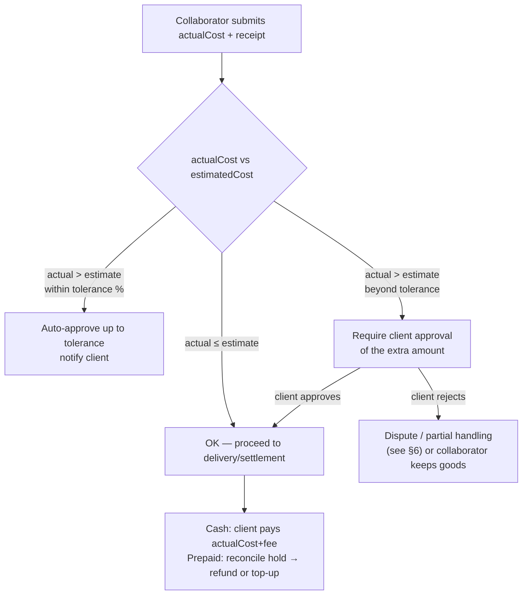

# BarriApp — Free Errand Flow ("Mandado")

> Status: **Design** (phase-2 differentiator, contemplated now). Complements
> [ORDER_FLOW.md](ORDER_FLOW.md), [DATA_MODEL.md](DATA_MODEL.md) (`errands`,
> `deliveries`, `payments`), and [AUDIT_LOG.md](AUDIT_LOG.md). A "mandado" is an
> open, peer-to-peer favor: a client describes something they need done/bought,
> offers a fee, and a nearby collaborator fulfills it.

## 1. What makes an errand different from an order
| | Order | Errand (mandado) |
|--|-------|------------------|
| Origin | A store + catalog | Free-text request, no catalog |
| Items | Known products & prices | Described by the client, prices unknown upfront |
| Money | items + deliveryFee + platformFee | **offeredFee** (collaborator earnings) + **purchase reimbursement** (variable) + platformFee |
| Key risk | stock, delivery | **cost uncertainty** (estimate vs. actual) + trust/safety |

Because the purchase cost is not known in advance, the errand flow adds a
**cost reconciliation** step (estimated → actual, with a receipt) that orders do
not have.

## 2. Money model

Two amounts are tracked separately:
- **`offeredFee`** — what the client pays the collaborator for the favor (the
  collaborator's earnings). The platform takes its `platformFee` from this.
- **`estimatedCost`** — the client's estimate of what the purchased goods will
  cost; reimbursed to the collaborator (not platform revenue).

### Payment modes
- **Cash — the ONLY mode at launch (decided).** Client pays the collaborator on
  delivery: `actual purchase cost (per receipt) + offeredFee`. Simplest, fits the
  barrio audience. The collaborator fronts the purchase cash → mitigated by an
  `estimatedCost` cap the collaborator accepts before starting.
- **Prepaid via Wompi (future enhancement, not in launch scope):** client prepays
  `offeredFee + estimatedCost` which the platform holds; on completion the
  **actual cost** is reconciled against a receipt — the difference is refunded
  (actual < estimate) or a top-up is requested with client approval (actual >
  estimate). Platform-held funds reduce the collaborator's cash risk. Deferred to
  avoid escrow-like hold + reconciliation complexity at launch.

## 3. State machine

```
open → assigned → in_progress → completed
  │        │            │
  │        │            ├─(sub-steps) shopping → purchased(receipt) → en_route → delivered
  └────────┴──── cancelled (before in_progress; or by mutual/dispute rules) ────┘
```

- `open` — published, visible to nearby collaborators.
- `assigned` — a collaborator accepted; a `delivery` (refType=`errand`) is created.
- `in_progress` — collaborator is executing (shopping/doing the favor); tracked
  via the same live-tracking mechanism as orders.
- `completed` — delivered, receipt attached (if purchase), payment settled.
- `cancelled` — see §6.

## 4. Happy path — CASH errand

```mermaid
sequenceDiagram
    autonumber
    actor C as Client
    participant API
    participant DB as MongoDB
    participant Q as Queue/Redis
    actor Col as Collaborator
    participant WS as WS/PubSub
    participant FCM

    C->>API: POST /errands (title, description, dropoff, offeredFee, estimatedCost, photo?)
    API->>DB: create errand (status=open) + audit(errand.created)
    API->>Q: enqueue notify nearby collaborators
    API-->>C: 201 {errand, code}
    Q->>FCM: push to online collaborators near dropoff/pickup (2dsphere)

    Col->>API: GET /errands/available?near=lng,lat&radius=
    API-->>Col: list of open errands (fee, distance, estimatedCost)
    Col->>API: POST /errands/{id}/accept
    API->>DB: status=assigned, collaboratorId, create delivery + audit(errand.accepted)
    API->>Q: notify(client, "collaborator accepted")

    Col->>API: POST /errands/{id}/status (in_progress)
    Note over Col,WS: Live tracking (same as ORDER_FLOW §5)
    Col->>API: POST /deliveries/{id}/location (throttled)
    API->>WS: publish location
    WS-->>C: live location + status

    Note over Col: Buys the items
    Col->>API: POST /errands/{id}/purchase (actualCost, receiptPhoto)
    API->>DB: store actualCost + receipt; run cost reconciliation (see §5)
    API->>Q: notify(client, "purchased — actual cost X")

    Col->>API: POST /errands/{id}/status (delivered)  →  completed
    Note right of API: Client pays CASH: actualCost + offeredFee
    API->>DB: payment.approved(cash); ledger: +offeredFee−platformFee (Col), +platformFee (platform); audit(errand.status.changed, payment.approved)
    API->>Q: notify(client, "completed — rate collaborator")
```

## 5. Cost reconciliation (estimate vs. actual)



**Parameters:** tolerance % over `estimatedCost` before client approval is
required; hard cap on `estimatedCost` per errand for launch (risk control).

## 6. Edge cases, cancellations & trust/safety

| Scenario | Handling |
|----------|----------|
| Client cancels while `open` | Allowed, no cost; audit `errand.cancelled` |
| Client cancels after `assigned` | Requires policy; if collaborator already incurred cost/effort → compensation rule (confirm) |
| Collaborator cancels mid-errand | Return to `open` for re-match or cancel; rating penalty; if already purchased → dispute path |
| Item unavailable / can't complete | Collaborator marks blocked; client chooses alternative or cancels |
| Actual cost >> estimate | Reconciliation §5 (client approval / tolerance / cap) |
| No collaborator accepts | Errand stays `open`; suggest raising `offeredFee`; expire after TTL |
| Dispute (goods/cost/no-show) | Dispute record + `super_admin` review (audited); manual resolution in MVP |
| Prohibited items (alcohol to minors, illegal, etc.) | Content policy + reporting; block categories |
| Safety | ratings both ways, verified collaborators only (see [COLLABORATOR_ONBOARDING.md](COLLABORATOR_ONBOARDING.md)), share live tracking, in-app contact masking |

## 7. Reuse & differences vs. order flow
- **Reused:** live tracking (WebSocket + Redis pub/sub), `deliveries` (polymorphic
  `refType=errand`), `payments`, `ledger_entries`, reviews, notifications, and the
  audit trail.
- **New to errands:** free-text request + photo, `offeredFee`/`estimatedCost`
  split, geo-broadcast to nearby collaborators (vs. store-triggered match), the
  **purchase/receipt step**, and **cost reconciliation**.

## 8. Endpoints touched
See [API_CONTRACT.md](API_CONTRACT.md) §7 (`/errands`) and §8 (`/deliveries`).
New endpoint implied by this flow: `POST /errands/{id}/purchase` (actualCost +
receipt) and `POST /errands/{id}/cost-approval` (client approves overage) — to be
added to the contract when errands enter implementation.
```
