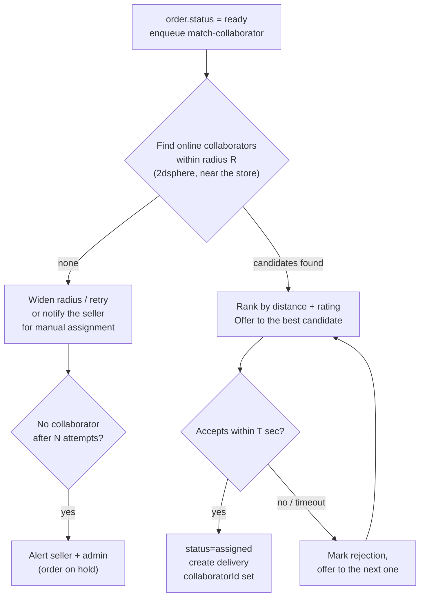
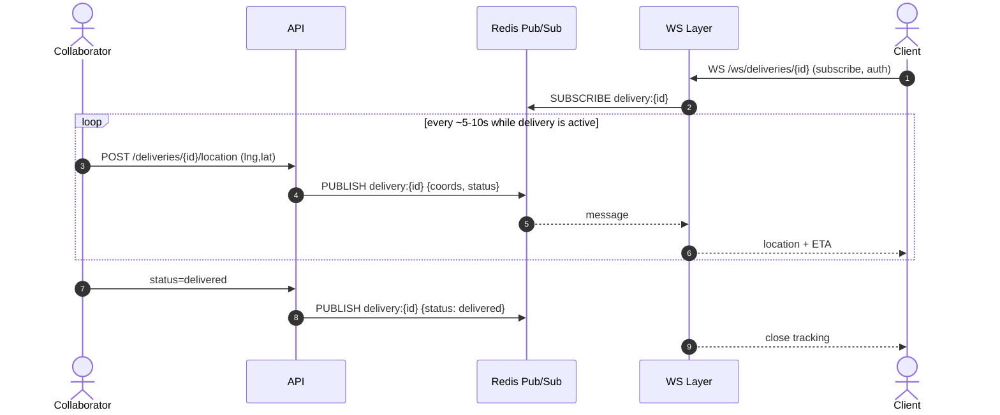

# BarriApp — Order Flow (End-to-End)

> Status: **Design**. Complements [DATA_MODEL.md](DATA_MODEL.md) and
> [API_CONTRACT.md](API_CONTRACT.md). Covers the lifecycle of an `order`
> (store order). Free errands (`errands`) have their own flow, summarized at
> the end.

## Actors and components
- **Client** (RN/Expo app)
- **API** (FastAPI)
- **Store / Seller** (RN/Expo app)
- **Collaborator** (RN/Expo app)
- **Wompi** (payment gateway)
- **Queue** (ARQ + Redis) — async jobs (matching, notifications)
- **WS / Redis Pub-Sub** — live tracking
- **FCM** — push notifications

## Design assumptions (to confirm)
1. **Payment:** two methods in the MVP — `cash` (on delivery) and `wompi`
   (online, prepaid).
2. **Assignment:** when the store marks the order as `ready`, the system
   **auto-matches** the nearest `online` collaborator; if nobody accepts within
   `T` seconds, it retries with the next one / falls back to manual assignment
   by the seller.
3. **Commission:** the platform withholds a `platformFee` from the total; the
   `deliveryFee` goes to the collaborator. (Exact rules still to be defined.)
4. **Stock reservation:** on order creation, stock is validated and decremented
   (if the store tracks it); it is restored if the order is cancelled.

---

## 1. State view (recap)

```
pending → accepted → preparing → ready → assigned → picked_up → delivered
   └──────────────── cancelled (before picked_up) ─────────────────┘
```

`payment`: `pending → approved | declined`; `approved → refunded`.

---

## 2. Happy path — CASH payment (on delivery)

```mermaid
sequenceDiagram
    autonumber
    actor C as Client
    participant API
    participant DB as MongoDB
    actor V as Seller
    participant Q as Queue/Redis
    actor Col as Collaborator
    participant WS as WS/PubSub
    participant FCM

    C->>API: POST /orders (items, address, method=cash)
    API->>DB: validate stock, compute amounts (items+deliveryFee+platformFee)
    API->>DB: create order (status=pending) + payment(method=cash, pending)
    API->>Q: enqueue notify(store, "new order")
    API-->>C: 201 {order, code}
    Q->>FCM: push to Seller
    FCM-->>V: "New order BA-XXXX"

    V->>API: POST /orders/{id}/accept
    API->>DB: status=accepted (+statusHistory)
    API->>Q: notify(client, "order accepted")
    Q->>FCM: push to Client

    V->>API: POST /orders/{id}/status (preparing)
    V->>API: POST /orders/{id}/status (ready)
    API->>DB: status=ready
    API->>Q: enqueue match-collaborator(orderId)

    Note over Q,Col: Auto-match (see section 4)
    Q->>DB: find nearest online collaborator (2dsphere)
    Q->>FCM: delivery offer to Collaborator
    Col->>API: POST /orders/{id}/accept-delivery
    API->>DB: status=assigned, collaboratorId, create delivery
    API->>Q: notify(client, "courier on the way")

    Note over Col,WS: Live tracking (see section 5)
    Col->>API: POST /deliveries/{id}/location (throttled)
    API->>WS: publish location
    WS-->>C: live location

    Col->>API: pickup at store → status=picked_up
    Col->>API: deliver → POST /deliveries/{id}/proof (photo)
    Col->>API: POST /orders/{id}/status (delivered)
    API->>DB: status=delivered
    Note right of API: Client pays CASH to the collaborator
    API->>DB: payment.approved; ledger: +deliveryFee (Col), +platformFee (platform)
    API->>Q: notify(client, "order delivered — rate it")
```

---

## 3. Happy path — WOMPI payment (online, prepaid)

The difference is that payment is charged **before** the store starts preparing,
to guarantee collection. The rest of the flow (accept → ready → assignment →
tracking → delivery) is identical.

```mermaid
sequenceDiagram
    autonumber
    actor C as Client
    participant API
    participant DB as MongoDB
    participant W as Wompi

    C->>API: POST /orders (method=wompi)
    API->>DB: create order (status=pending) + payment(method=wompi, pending)
    API-->>C: 201 {order, paymentId}

    C->>API: POST /payments/intent (Idempotency-Key)
    API->>W: create transaction
    W-->>API: checkout data (link/token)
    API-->>C: checkout data
    C->>W: complete payment (PSE/card/Nequi)

    W-->>API: POST /payments/webhook/wompi (HMAC signature)
    API->>API: verify signature
    alt payment approved
        API->>DB: payment.approved; order proceeds to accept/preparing
        API->>C: (push) "payment confirmed"
    else payment declined
        API->>DB: payment.declined; order.status=cancelled
        API->>DB: restore stock
        API->>C: (push) "payment declined, order cancelled"
    end
```

> **Idempotency:** the Wompi webhook may arrive more than once; it is processed
> by `transactionId` and never applied twice (idempotent ledger).

---

## 4. Collaborator assignment (auto-match)



**Configurable parameters:** initial radius `R`, offer timeout `T`, number of
retries `N`, ranking criteria (distance, rating, current load).

---

## 5. Live tracking (WebSocket)



**Notes:**
- Location is **throttled on the client** (not every second) to save battery/data.
- Sampled *breadcrumbs* are stored in `delivery.route` (not every point).
- Redis pub/sub lets this work across **multiple API replicas**.

---

## 6. Edge cases and cancellations

| Scenario | Handling |
|----------|----------|
| Client cancels before `accepted` | Allowed; if Wompi already charged → `refund`; restore stock |
| Client cancels after `preparing` | Requires a policy (possible partial charge); confirm rules |
| Store rejects the order | `cancelled`; refund if applicable; notify client |
| No collaborator available | Order on hold; alert seller/admin; option to cancel |
| Collaborator accepts but does not pick up | Timeout → reassign; rating penalty |
| Wompi payment declined | `order.cancelled`, stock restored |
| Duplicate Wompi webhook | Idempotent by `transactionId` |
| Stock failure at creation | 409, order not created |
| Product unavailable while preparing | Seller adjusts/cancels; notify client |

---

## 7. Side effects per transition (summary)

| Transition | Effects |
|------------|---------|
| create order | validate + decrement stock; create payment; notify store |
| `accepted` | notify client |
| `ready` | trigger collaborator auto-match |
| `assigned` | create `delivery`; notify client; open tracking channel |
| `picked_up` | start tracking toward the client |
| `delivered` | close tracking; cash → `payment.approved`; write ledger (deliveryFee, platformFee); enable review |
| `cancelled` | restore stock; refund if applicable; notify involved parties |

---

## 8. Free errand (`errand`) flow — summary

Differs from an order in that there is **no store or catalog**: the client
describes the errand and offers an `offeredFee`.

```
open (client posts) → collaborator sees nearby errands → accept → assigned
   → in_progress (buy/execute) → completed
```

- No stock validation or catalog; the `estimatedCost` (purchase reimbursement) is
  settled separately from the `offeredFee` (the collaborator's earnings).
- Tracking and payment reuse the same mechanism (polymorphic `deliveries`,
  `payments`).
- Detailed in its own document in phase 2.
```
