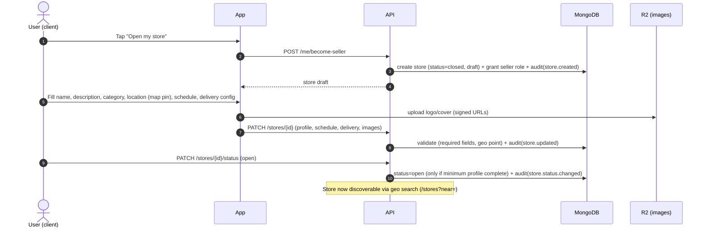
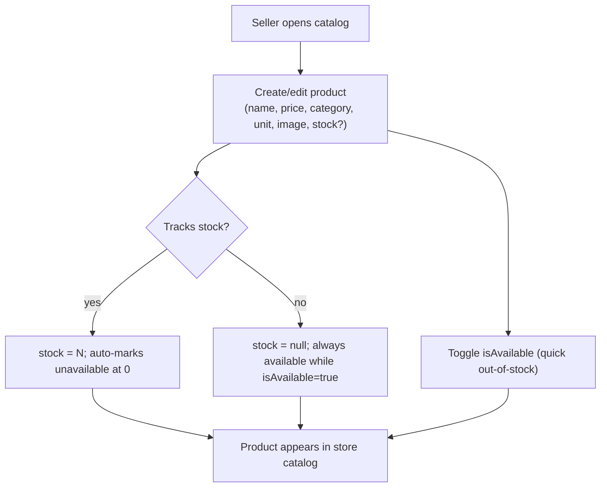

# BarriApp — Seller / Store Flow

> Status: **Design**. Complements [DATA_MODEL.md](DATA_MODEL.md) (`stores`,
> `products`, `orders`, `ledger_entries`), [API_CONTRACT.md](API_CONTRACT.md)
> (§3, §4, §6), [ORDER_FLOW.md](ORDER_FLOW.md), and [AUDIT_LOG.md](AUDIT_LOG.md).
> Covers how a seller (tendero) onboards a store, manages catalog, handles
> orders, and sees earnings.

## 1. Seller lifecycle (overview)
```
client ──become-seller──▶ store (draft) ──setup──▶ store (open) ⇄ (closed) ──▶ (suspended by admin)
```
Unlike collaborators, sellers **do not require manual KYC approval** to start in
the MVP (low friction): a client can create a store and open it once the minimum
profile is complete. Moderation/suspension by the `super_admin` is reactive (see
[ADMIN_PANEL.md](ADMIN_PANEL.md)). *(Open question: require any verification for
sellers who accept online payments? Deferred — cash-first at launch.)*

## 2. Store onboarding & setup



**Minimum to open:** name, category, valid `location.geo`, at least one schedule
block, delivery config (`radiusMeters`, `baseFee`, `minOrder`), and ≥1 available
product. Enforced server-side.

## 3. Catalog management



- CRUD on products scoped to the store owner (RBAC + ownership).
- **Fast availability toggle** (`isAvailable`) for the common "se acabó" case,
  separate from full stock tracking (optional per product).
- Bulk-friendly later; single-item CRUD for MVP.
- All changes audited (`product.created/updated/deleted`, `product.availability.changed`).

## 4. Order management (seller side)

The seller side of [ORDER_FLOW.md](ORDER_FLOW.md). Seller-facing states:

```
new (pending) → accepted → preparing → ready → [handed to collaborator] → (delivered)
      └─ rejected ─┘
```

```mermaid
sequenceDiagram
    autonumber
    participant FCM
    actor V as Seller
    participant App
    participant API
    participant DB

    FCM-->>V: push "New order BA-XXXX"
    V->>App: Open order (items, amounts, client note, address)
    alt accept
        V->>API: POST /orders/{id}/accept
        API->>DB: status=accepted + audit(order.accepted)
        V->>API: POST /orders/{id}/status (preparing)
        V->>API: POST /orders/{id}/status (ready)
        API->>DB: status=ready → triggers collaborator auto-match (ORDER_FLOW §4)
    else reject
        V->>API: POST /orders/{id}/cancel (reason)
        API->>DB: status=cancelled; refund if Wompi; restore stock; audit(order.rejected)
    end
    Note over V: If no collaborator found, seller may assign manually (POST /orders/{id}/assign)
```

- Seller sees a live queue of orders by status (`GET /stores/{id}/orders?status=`).
- Reject requires a reason (feeds metrics + client notification).
- **Product-unavailable while preparing:** seller edits the order / cancels with
  reason; client is notified (edge case in ORDER_FLOW §6).

## 5. Store availability
- `open` / `closed` manual toggle + automatic closed outside `schedule` hours.
- A closed store stays discoverable but cannot receive new orders.
- `suspended` is admin-only (moderation) — seller cannot self-unsuspend.

## 6. Earnings & payouts (seller)
- Each delivered+paid order writes `ledger_entries`: store earning (order items
  total minus platform commission) and the platform commission.
- Seller views balance and movements (`GET` earnings — to be added alongside the
  collaborator earnings endpoint).
- **Payout/settlement mechanism** (how and when the platform pays sellers:
  frequency, method, minimum) depends on the **commission model** — being planned
  separately (see COMMISSION doc, in discussion).
- Cash orders: the collaborator collects cash; reconciliation of who owes whom
  (store vs. platform vs. collaborator) is defined by the commission model.

## 7. Seller metrics (in-app, lightweight)
- Today/period: orders, revenue, average ticket, rejection rate, top products.
- Distinct from the `super_admin` platform metrics ([ADMIN_PANEL.md](ADMIN_PANEL.md)).

## 8. Endpoints touched
`POST /me/become-seller`, `POST /stores`, `PATCH /stores/{id}`,
`PATCH /stores/{id}/status`, `GET /stores/{id}/orders`,
`POST /stores/{id}/products`, `PATCH|DELETE /products/{id}`,
`POST /orders/{id}/accept|status|cancel|assign`. See [API_CONTRACT.md](API_CONTRACT.md).

## 9. Backlog linkage
Maps to MVP_BACKLOG U-4 (become seller), S-1..S-6 (store + catalog + search),
O-2..O-4 (seller order handling), P-4/P-5 (ledger/earnings).
```
